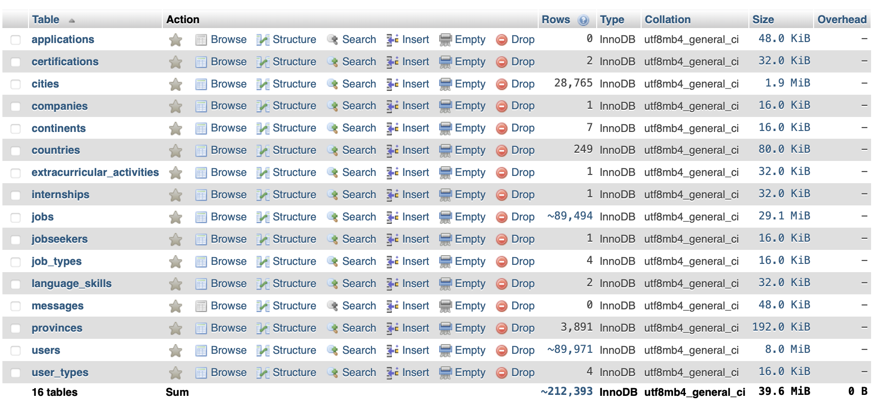

# DMS Project - Job-seeking Platform

## User Guide

The entire project folder should be put directly in the `htdocs` folder. For example, `xamppfiles/htdocs/job_platform`   

At the homepage, if the database is not already created. You need to create the database through two options: run PHP scripts or manually import `/job_platform/assets/data/job_platform_db.sql` in `phpmyadmin`. It is recommended for **old computers** to manually import the database. If the database creating scripts raise timeout errors, you may alter the amount of simulated job instances by changing this line `$totalJobs = 90000;` in `config/database.php`. You can also adjust `$numEmployers` and `$numJobseekers` in `config/database.php`. Or delete lines in `data/cities15000.txt`.   

Simulated job instances are distributed into each city based on its population porpotion.  


## Project Structure
```
index.php: Entry point for the application
.htaccess: For URL rewriting and other Apache configurations
/assets: Contains static files like CSS, JavaScript, and images
    /css: Stylesheets
    /js: JavaScript files
    /images: Images
    /data: Data for SQL database
    /text: Short text files for random advice on the footer
/views: Webpages
/config: Configuration files for database connection, settings, etc
/uploads: Stores uploaded files, note that avatars are stored in SQL database
```

## Shape of the Database after Initialization
The database has 16 tables and more than 210,000 rows.  


## Version Control Instruction
### Set Up Git
**Install Git:** All team members should have Git installed. You can download it from `git-scm.com`.
```
git config --global user.name "Your Name"
git config --global user.email "your.email@example.com"
```

### Project Clone
```
git clone https://github.com/sssh3/job_platform
```

### Make Your Own Change
Please keep the `main` branch as the stable version.  
Each team member should create their own branch for new features or bug fixes. This can be done using:
```
git checkout -b feature-branch-name
git pull # keep updated with the main branch
```

### Push Your Change
1. Make sure you are on your branch. Use `git branch` to check, `git checkout your-branch-name` to switch branch.

2. Commit changes using 
```
git add .
git commit -m "Your descriptive commit message"
```
You can see the status with `git status`.

3. Push your branch to remote by `git push origin your-branch-name`


## Columns 
Records of data columns obtained from geonames.org.  

### cities15000.txt
```
geonameid : integer id of record in geonames database
name : name of geographical point (utf8) varchar(200)
asciiname : name of geographical point in plain ascii characters, varchar(200)
alternatenames : alternatenames, comma separated, ascii names automatically transliterated, convenience attribute from alternatename table, varchar(10000)
latitude : latitude in decimal degrees (wgs84)
longitude : longitude in decimal degrees (wgs84)
feature class : see http://www.geonames.org/export/codes.html, char(1)
feature code : see http://www.geonames.org/export/codes.html, varchar(10)
country code : ISO-3166 2-letter country code, 2 characters
cc2 : alternate country codes, comma separated, ISO-3166 2-letter country code, 200 characters
admin1 code : fipscode (subject to change to iso code), see exceptions below, see file admin1Codes.txt for display names of this code; varchar(20)
admin2 code : code for the second administrative division, a county in the US, see file admin2Codes.txt; varchar(80)
admin3 code : code for third level administrative division, varchar(20)
admin4 code : code for fourth level administrative division, varchar(20)
population : bigint (8 byte int)
elevation : in meters, integer
dem : digital elevation model, srtm3 or gtopo30, average elevation of 3''x3'' (ca 90mx90m) or 30''x30'' (ca 900mx900m) area in meters, integer. srtm processed by cgiar/ciat.
timezone : the iana timezone id (see file timeZone.txt) varchar(40)
modification date : date of last modification in yyyy-MM-dd format

used columns: 
`asciiname` for `city_name`, 
`cc2` for `country_code`, 
`admin1 code` for `admin1_code`, 
`population`
```
### admin1CodesACSII.txt
Columns: code, name, name ascii, geonameid
